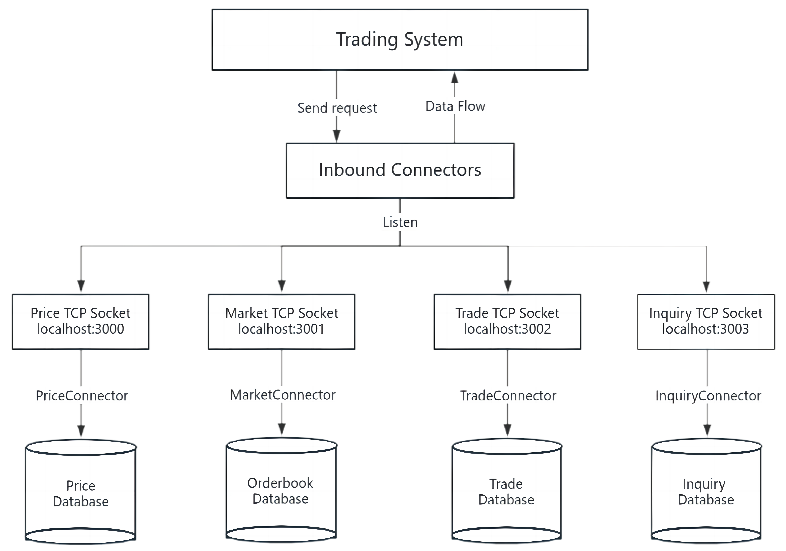

# Trading-System
 An asynchronous and low-latency trading system designed under service-oriented architecture (SOA). 

The project gives an example of a trading system for seven US Treasury securities, with real-time price and orderbook flows, data streaming, user inquiries, algorithm order execution, risk monitor, logging modules, etc.

## Service Architecture


Data flow into the trading system through `Subscribe()` that calls `OnMessage()`, transmit among different service components through `ProcessAdd()`, and flow out of the system through `Publish()`.

#### Connector

Connectors can be subscribe-only or publish-only, or both. A input file connector can both `Subscribe` data from outside data source and `Publish` data to a socket with specified host and port. An inbound connector can then subscribe data from the socket and flow data into the trading system through calling `Service.OnMessage()`, or publish data to outside source using `Service.Publish()`.

## Client-Server Pattern


The whole system follows a client-server pattern through asynchronous I/O. The program consists of four client programs that subscribes external data and publish to TCP sockets, and a main server program running six servers simultaneously using multi-threading. Data flows into the trading system through connectors from connectivity source (e.g. a socket, database, etc).

#### Socket-based Communication
Communication between different components is based on socket to ensure real-time, low-latency and high-throughput. Six servers are running simultaneously, with four (price, market, trade, inquiry server) listening to TCP sockets from `localhost:3000` to `localhost:3004` and flow data into the system, and two (steaming and execution server) publishing data to TCP sockets `localhost:3004` and `localhost:3005`.


## Deployment
The instruction to run the system on a Linux machine is as follows (tested on Ubuntu 22.04). Before running the system, make sure you have installed `boost` and `cmake` tools, and check firewall settings to open local ports `3000-3005` for TCP sockets (important!)
```bash
# install boost and cmake tools
sudo apt-get update
sudo apt-get install libboost-all-dev
sudo apt install cmake
```

The direct way is simply run the bash script `run.sh` in the root directory. It starts the system and the servers in the foreground, then start the four client programs in the background.
```bash
chmod +x run.sh
./run.sh
```

Or one can manually build and run the system.
```bash
# compile and start servers
mkdir build
cd build
cmake ..
make
./server

# start clients in separate terminals
./price
./market
./trade
./inquiry
```


## Scripts
- Main program
  - `InputPriceConnector`: an input connector that subscribes external price data and publishes to TCP socket `localhost:3000`
  - `InputMarketDataConnector`: an input connector that subscribes external orderbook data and publishes to TCP socket `localhost:3001`
  - `InputTradeConnector`: an input connector that subscribes external trade data and publishes to TCP socket `localhost:3002`
  - `InputInquiryConnector`: an input connector that subscribes external user inquiry data and publishes to TCP socket `localhost:3003`
  - `StreamOutputConnector`: an outbound connector that subscribes streaming flow data from TCP socket `localhost:3000` and publishes to `localhost:3004`
  - `ExecutionOutputConnector`: an outbound connector that subscribes execution data from TCP socket `localhost:3001` and publishes to `localhost:3005`
  - `main`: connect different services, attach six threads to six servers, and start listening to TCP sockets `localhost:3000-3005`


- Service components

  - `pricingservice`: read in price data from the socket to the system through an inbound connector
  - `algostreamingservice`: listen to pricing service, flow in data of `Price<T>` and generate data of `AlgoStream<T>`  
  - `streamingservice`: listen to algo streaming service, flow in data of `AlgoStream<T>` and record bid/ask prices into `priceStream<T>`, publish streams via socket in a separate process
  - `guiservice`: a GUI component that listens to streaming prices that should be throttled with a 300 millisecond throttle., register a service listener on the pricing service and output the updates with a timestamp with millisecond precision to a file `gui.txt`.
  - `marketdataservice`: read in orderbook data from the socket to the system through an inbound connector
  - `algoexecutionservice`: listen to market data service, flow in data of `Orderbook<T>` and turn into execution data `AlgoExecution<T>`
  - `executionservice`: listen to algo execution service, flow in data of `AlgoExecution<T>` and record order information into `ExecutionOrder<T>`, publish order executions via socket in a separate process
  - `tradebookingservice`: read in trade data, listen to execution service at the same time, flow in `ExecutionOrder<T>` and turn in trade data of type `Trade<T>`
  - `positionservice`: listen to trade booking service, flow in `Trade<T>` data and turn into `Position<T>`
  - `riskservice`: listen to position service, flow in `Position<T>` data and calculate corresponding position risks, such as `PV01<T>`. 
  - `inquiryservice`: read in user inquiry data, interact with connectors and deal with inquiries

- Other components
  - `products`: define the class for the trading products, can be treasury bonds, interest rate swaps, future, commodity, or any user-defined product object
  - `historicaldataservice`: a last-step service that listens to position service, risk service, execution service, streaming service, and inquiry service; persist objects it receives and saves the data into database (usually data centers, KDB database, etc)
  - `utils`: time displayer, data generator, and risk calculator

- Data and results

  - `data`: data source for price data, orderbook updates, user inquiries, and trade data, can be replaced by other connectivity source (a database, socket, etc)

  - `res`: results published by the system, including processed queries, executed orders, positions, risk monitor, data streaming, and GUI output.

## Note
The trading system is designed to be scalable, extensible, and maintainable. Multi-threading and asynchronous programming ensures low-latency, high-throughput, and high-performance. The system is also designed to be modularized, with each service component being independent and loosely coupled with others. New trading products can be added into `products.hpp`, new services, listeners, connectors can all be easily added and integrated into the whole system.